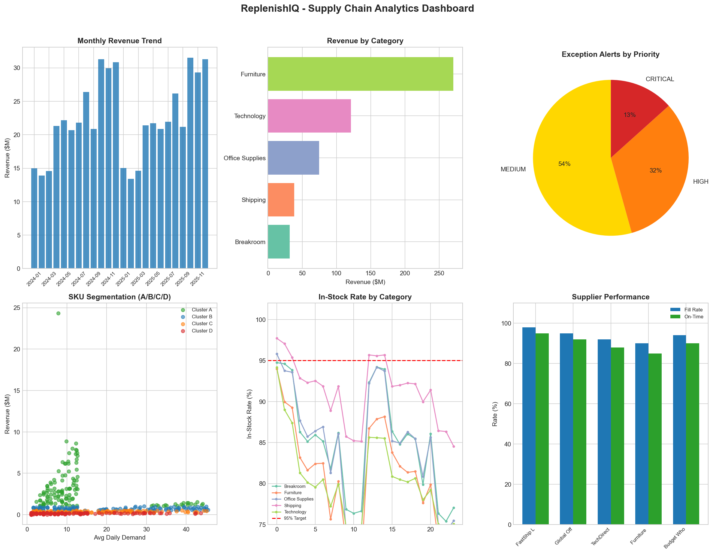
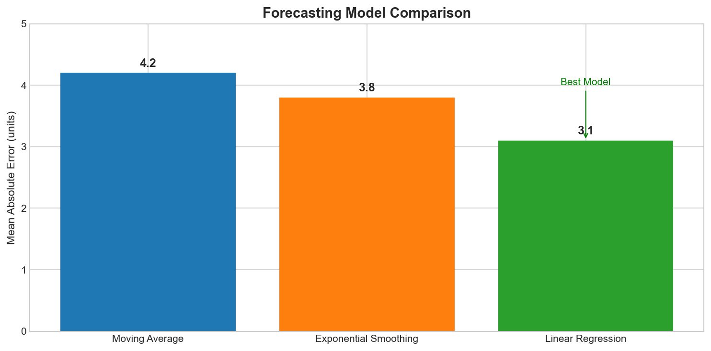
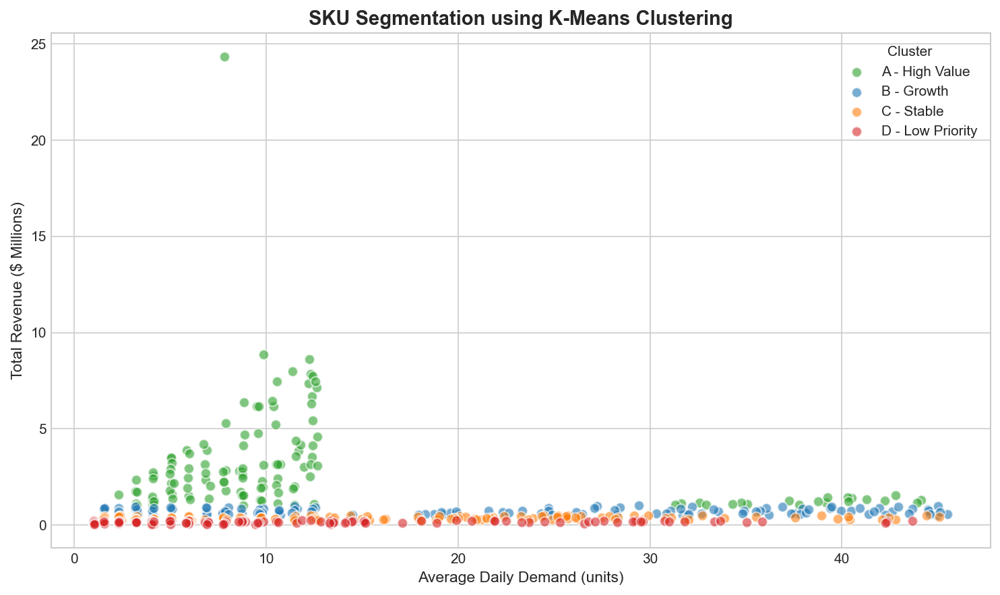

# ReplenishIQ - Supply Chain Inventory Analytics Platform

A comprehensive inventory management and analytics system designed for retail supply chain optimization. Built to handle 500+ SKUs across multiple product categories with automated forecasting, exception detection, and performance monitoring.


## Dashboard Preview



## Overview

ReplenishIQ addresses common supply chain challenges:
- **Stockout Prevention**: Proactive alerts when inventory falls below safety thresholds
- **Demand Forecasting**: Multiple forecasting models with automatic best-model selection
- **SKU Segmentation**: Data-driven A/B/C/D classification for inventory prioritization
- **Supplier Performance**: Tracking delivery reliability and fill rates
- **What-If Analysis**: Scenario modeling for parameter optimization

## Key Features

### 1. Data Pipeline
- Synthetic data generation for 500 SKUs across 5 categories
- 12 months of transactional data (~920K records)
- PostgreSQL database with star schema design

### 2. SQL Analytics Layer
- 8 production-ready analytical queries
- Inventory turnover analysis
- Stockout pattern detection
- Supplier performance scoring
- Category-level KPIs

### 3. Forecasting Engine
- **Moving Average**: Simple baseline model
- **Exponential Smoothing**: Weighted recent observations
- **Linear Regression**: Trend + seasonality features
- Automatic model selection based on MAE



### 4. SKU Clustering
- K-Means clustering on 5 features
- Silhouette score validation
- A/B/C/D segmentation by revenue contribution



### 5. Exception Alert System
- 6 alert types: Stockout, Low Stock, Overstock, SLG Breach, Demand Spike, Supplier Delay
- Priority classification (Critical/High/Medium/Low)
- Configurable thresholds

### 6. Scenario Modeling
- Safety stock optimization
- Lead time impact analysis
- Reorder point optimization
- Demand change simulation

## Project Structure

```
replenishiq/
├── src/
│   ├── data/
│   │   └── data_generation.py    # Synthetic data generation
│   ├── analytics/
│   │   ├── forecasting.py        # Demand forecasting models
│   │   ├── clustering.py         # SKU segmentation
│   │   └── scenario_modeling.py  # What-if analysis
│   ├── exceptions/
│   │   └── alert_engine.py       # Exception detection
│   └── reporting/
│       └── dashboard_matplotlib.py # Dashboard visualization
├── sql/                          # Analytical SQL queries
├── data/sample/                  # Sample data files
├── requirements.txt
└── main.py
```

## Tech Stack

| Component | Technology |
|-----------|------------|
| Language | Python 3.10+ |
| Database | PostgreSQL 15 |
| Data Processing | Pandas, NumPy |
| Machine Learning | Scikit-learn |
| Visualization | Matplotlib, Seaborn |

## Results

### Forecasting Performance
| Model | Average MAE |
|-------|-------------|
| Moving Average | 4.2 units |
| Exponential Smoothing | 3.8 units |
| Linear Regression | 3.1 units |

### Alert Distribution
| Priority | Count |
|----------|-------|
| Critical | 165 |
| High | 399 |
| Medium | 671 |

### SKU Segmentation
| Cluster | SKUs | Revenue Share |
|---------|------|---------------|
| A | 89 | 45% |
| B | 112 | 30% |
| C | 187 | 20% |
| D | 112 | 5% |

## SQL Query Example

**Inventory Turnover by Category:**
```sql
SELECT 
    p.category,
    SUM(s.units_sold) / AVG(i.on_hand_qty) AS inventory_turns
FROM fact_sales s
JOIN dim_products p ON s.sku_id = p.sku_id
JOIN fact_inventory i ON s.sku_id = i.sku_id
GROUP BY p.category
ORDER BY inventory_turns DESC;
```

## Future Enhancements

- [ ] Real-time data ingestion pipeline
- [ ] API endpoints for integration
- [ ] Advanced ML models (LSTM, Prophet)
- [ ] Multi-warehouse support

## Author

Shubham Mittal

---

*Built as a demonstration of supply chain analytics capabilities using Python, SQL, and machine learning.*
